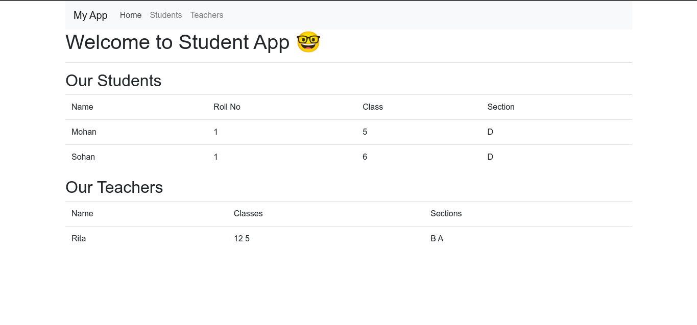
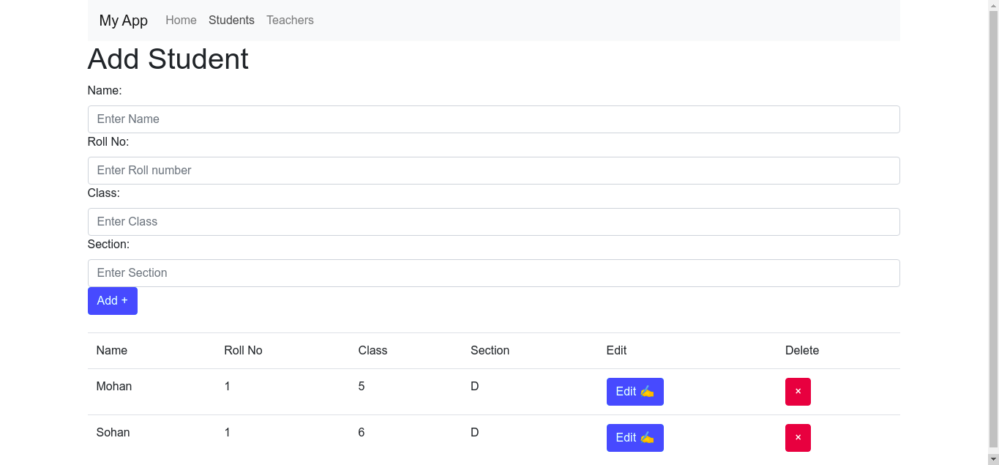
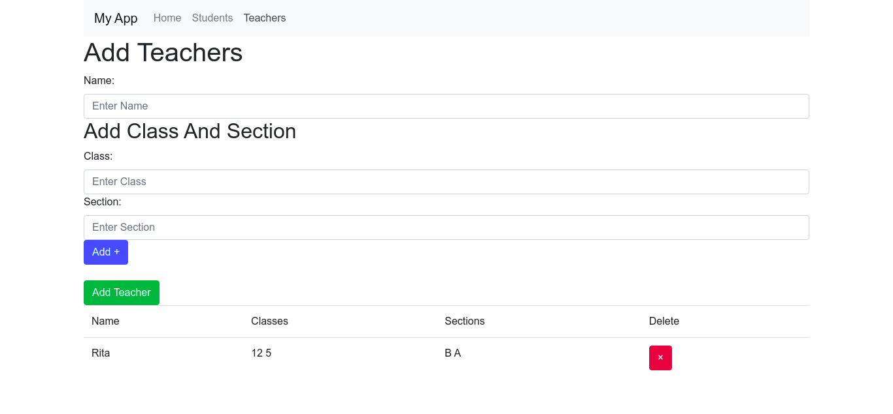

# Student App 👩‍🎓👨‍🎓
In this App You can `add a student`, `add a teacher`, `delete a student`, `update a student` and `you can see all the students`.

### Home page

### Students page

### Teachers page

## 🛠️ Installation Steps:

1. Clone the repository

```bash
git clone https://github.com/vivek80801/studentApp.git
```

2. Change the working directory

```bash
cd studentApp
```

3. Install dependencies

```bash
npm install
```

4. Run the app

```bash
npm start
```

### 🌟 You are all set!

## 💻 Built with...

- [x] [React](https://reactjs.org/)
- [x] [react-router-dom](https://reactrouter.com/web/guides/quick-start): for routing
- [x] [typescript](https://www.typescriptlang.org/)
- [x] [react-bootstrap](https://react-bootstrap.github.io/): for adding bootstrap in react

## Willing to contribute on this project 👌 ?

Please Check [CONTRIBUTING.md](https://github.com/vivek80801/studentApp/blob/master/CONTRIBUTING.md) and [CODE_OF_CONDUCT.md](https://github.com/vivek80801/studentApp/blob/master/CODE_OF_CONDUCT.md)

### Steps to add your ideas!
- [x] Open an [issue](https://github.com/vivek80801/studentApp/issues) with your ideas!
- [x] Fork the repo to get your own copy!
- [x] Clone your forked version!
- [x] Add your changes!
- [x] Open your pull request!    
